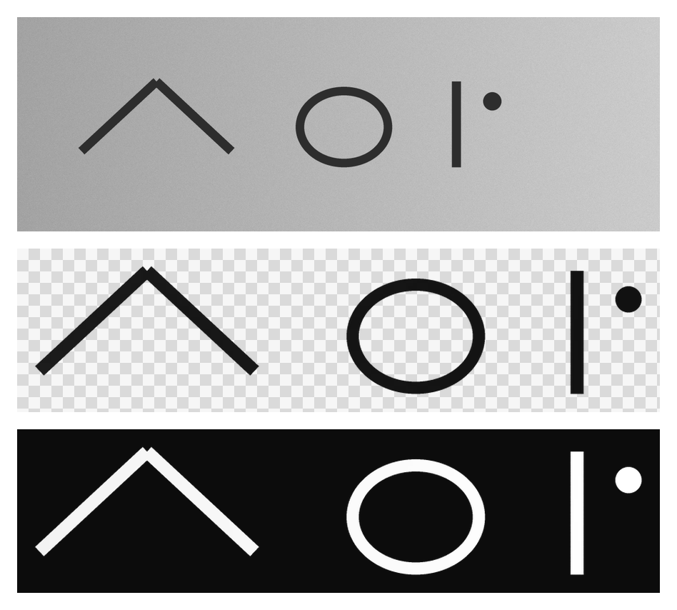

<div align="center">

# INKWELL

**Photograph something you wrote. Get back a transparent, print-ready mark that still looks like ink.**

No threshold is applied to the matte. The grayscale ramp of the photograph becomes the alpha channel, so the anti-aliased stroke edge survives, and so does the reason the mark reads as ink. The vector tracer is the one exception, for the reason given under [The Command Line](#the-command-line).

[](https://inkwell.puddystudios.com/)
[](LICENSE)
[](pyproject.toml)
[](.github/workflows/test.yml)
[](#privacy)
[](#the-browser-tool)

**Live: [inkwell.puddystudios.com](https://inkwell.puddystudios.com/)** - Nothing is uploaded, and it works offline once opened.



<sub>Lit, grainy paper in. Transparent alpha out. Any color, one matte.</sub>

**◆ Built by [PUDDY](https://puddystudios.com) to put a sharpie signature on a printed card.**

</div>

---

## What It Is

Sign your name on paper. Take a photo of it with a phone. INKWELL returns a PNG with a real alpha channel, in whatever color you ask for, plus a vector trace for foil work and the print geometry to place it on a card.

There are two ways in. A browser tool that runs entirely on the device, and a Python library and command line for the work that belongs in a pipeline. They share an engine and produce the same matte.

## The Photograph Is The Problem

Extracting ink from a scan is easy. Extracting it from a photograph is not, and almost every tool that tries does the same thing: threshold the image, keep the dark pixels, discard the rest.

Thresholding is why extracted signatures look wrong. A hard cut throws away the anti-aliased edge of the stroke, the variation where the pen pressed harder, and the skip where a dry marker lifted off the page. What survives is a flat silhouette. The eye reads a flat silhouette as clip art, and it reads it that way instantly, even when the viewer cannot say what is wrong.

So the ramp is kept, and used directly as the alpha channel. Every soft edge that made the mark look handmade is still there in the output.

Two corrections have to land before that ramp is usable, and both come from the camera rather than the ink.

**Paper is not white.** A phone meters for the dark marks, so a sheet of ordinary printer paper comes back around luma 185 rather than 255. Inverting that directly leaves the background sitting near 27 percent opacity: a gray veil across the entire design, visible the moment the mark is placed on anything.

**Lighting is not even.** There is a gradient across the sheet and texture within it. No single black point and white point corrects a gradient. Raising the floor far enough to clear the dark corner eats the thin strokes in the bright one, and lowering it far enough to keep them leaves the corner gray.

Flat-field correction solves both at once, and it works because of a property of the ink itself. Dilating the image past the stroke width erases the marks entirely, because every dark pixel gets overwritten by the brighter paper around it. What remains is a map of how the sheet was lit. Blur that map, divide the original by it, and illumination normalizes per pixel. The paper lands at a uniform white no matter how the photograph was taken.

## Finding The Cliff

A photograph picks up more than the mark. Grain, dust, the shadow along the edge of the sheet, the shadow of the pen. All of it survives flat-field correction, because all of it is a genuine change in luminance.

Two obvious filters fail here, and the failures are the reason the third exists.

A fixed size threshold cannot be shared between images. The dot over an i and the shadow along a sheet edge are comparably sized. One photograph's signal is the next photograph's noise, so any constant is wrong for something.

A position filter fails differently. The intuition is that real punctuation sits inside the span of the main glyphs while artifacts sit outside it, so small marks within that span can be kept. In practice grain is scattered across the whole frame, so the span contains hundreds of specks. Measured on a real photograph, that rule kept 588 of them.

What does separate ink from grain is scale. Ink runs orders of magnitude larger, and the size distribution has a cliff rather than a slope:

```
signature      208856, 89173, 88238, 5890, 1805  ||  88, 76, 76 ...      21x
phone number   30289 ................... 13771   ||  297, 189 ...        46x
```

The gap is enormous, and it sits somewhere different in every image. So INKWELL finds the cliff instead of hardcoding where it should be. Sort the component sizes, take the largest consecutive ratio, cut there. It calibrates itself per photograph, and it keeps the punctuation.

The limit is worth stating plainly, because it is the one case that defeats this. Scale is the only axis being used, so an artifact **larger** than the smallest real mark cannot be separated from ink by any cut along it. Worse, the cliff then lands in the wrong gap: a thumb smudge bigger than the dot over an i is kept, and the dot is lost. There is no threshold that does better on that axis. Crop the smudge out before extracting. A test pins the behavior so nobody mistakes it for a bug that can be tuned away.

## Print Geometry

Print jobs are rejected for arithmetic, not for art. Three rectangles matter, and they are concentric: the canvas that gets uploaded, the trim where the blade falls, and the safe area everything important stays inside. The gap between canvas and trim is bleed, and it exists because blades wander. Artwork stopping exactly at the trim line shows a white sliver the moment a cut drifts half a millimetre outward.

```bash
inkwell presets
inkwell template mpc-business --dpi 600
```

| preset | trim | canvas @300 | canvas @600 |
| --- | --- | --- | --- |
| `mpc-business` | 2 x 3.5 in | 672 x 1122 | 1344 x 2244 |
| `mpc-tarot` | 2.75 x 4.75 in | 897 x 1497 | 1794 x 2994 |
| `mpc-poker` | 2.5 x 3.5 in | 822 x 1122 | 1644 x 2244 |
| `mpc-bridge` | 2.25 x 3.5 in | 747 x 1122 | 1494 x 2244 |
| `mpc-mini` | 1.75 x 2.5 in | 597 x 822 | 1194 x 1644 |
| `mpc-big` | 3.5 x 5.75 in | 1122 x 1797 | 2244 x 3594 |
| `business-card` | 3.5 x 2 in | 1126 x 676 | 2252 x 1352 |

`template` writes a transparent overlay: solid magenta on the trim, dashed cyan on the safe area. Layer it above the artwork while designing and hide it before exporting.

One number is worth recording because it is expensive to discover. MakePlayingCards documents an eighth-inch bleed, which is 37.5 pixels at 300dpi, and then rounds it down to 36. Building to 26 instead, an easy transposition, produces a 652 by 1102 canvas where 672 by 1122 was required. That fails twice over. Stretched to fill, the artwork lands at 291 effective dpi and trips the resolution warning. The aspect ratio no longer matches either, so the overflow crops unevenly along the edges. One wrong number, two symptoms that look unrelated.

Bleed is therefore stored in pixels at 300dpi rather than in inches, so a vendor's rounding is reproduced exactly rather than recalculated.

Work at twice the published minimum. Sitting exactly on the 300dpi floor means any transform in a vendor's web editor, a nudge or a rotate or a rescale to fit, resamples below it and the warning returns.

## The Browser Tool

**[inkwell.puddystudios.com](https://inkwell.puddystudios.com/)**

`web/` is the whole application, and what is served at that address is exactly what is in this directory. No build step, no dependencies, no bundler, and no network call after the page loads. Six files carry it: the page, the stylesheet, the engine, the UI module, the worker, and a service worker that makes it work offline.

```bash
cd web && npm run dev        # or open index.html directly
```

The engine is a port of the Python library and produces the same matte, within a pixel or two of the same crop. It runs in a Web Worker, so a four megapixel photograph extracts without the page freezing.

Pick any ink from the six presets or type a hex code, and download PNG or WEBP. Both carry a real alpha channel. Vector output is command line only, for the reason in the next section.

Getting there took removing two things rather than adding any. Routing the grayscale through a full-resolution canvas purely to shrink it cost 1.2 seconds; the browser downscales the source directly in 30 milliseconds. Scaling the illumination field back up to full resolution cost a further 3.3 seconds, most of it pulling eighteen megabytes back off the GPU, to reconstruct a field that is smooth by construction and can be interpolated for the price of a few multiplies. A 4.6 megapixel photograph went from 5.7 seconds to roughly 2.

## The Command Line

```bash
pip install inkwell-ink
inkwell extract signature.jpg --inks white gold --trace
```

That writes `signature-white.png`, `signature-gold.png`, and `signature.svg`.

```python
from inkwell import extract

mark = extract("signature.jpg")
mark.colorize((255, 255, 255)).save("signature-white.png")
```

| flag | what it does |
| --- | --- |
| `-i, --inks` | `black` `white` `gold` `silver` `red` `blue`, or any `#rrggbb`. Repeatable. |
| `-t, --trace` | Also write an SVG. |
| `--invert` | Light ink on dark paper, such as a paint pen on black card. |
| `--no-clean` | Keep grain and artifacts. Useful for diagnosing a bad extraction. |
| `--margin` | Padding around the mark, as a fraction of its width. Default `0.03`. |
| `--threshold` | Vector trace cut. Default `110`. Raster output ignores it. |

Color is applied from the flag rather than sampled from the photograph, so no paper cast survives. One photo of black marker yields a clean white mark.

The vector output exists for foil, letterpress, embossing, and spot varnish. Those are applied through a physical plate, and the vendor needs a closed outline to cut it from rather than a grid of pixels. A gold foil signature is a vector job or it is not a job. Tracing is the one place a threshold is correct, because a vector curve has no anti-aliasing to preserve. The curve is the edge.

Tracing needs [potrace](https://potrace.sourceforge.net/) and is optional. Everything else works without it.

There is no vector export in the browser, and `web/trace.js` is why. A page cannot shell out to potrace, so that file is an attempt at a contour follower written from scratch: marching squares to walk the ink boundary, then Ramer-Douglas-Peucker to drop the redundant points. It closes correctly on a filled square and on a diagonal, and it fails on any shape with a hole, because an interior contour winds opposite to an exterior one and a single direction table cannot follow both. On a real signature it emitted 474 subpaths, 472 of them under four points, which is fragments rather than outlines. The file is kept, unwired and labelled, because the walk and the simplification are both sound and what it needs is orientation-aware seeding. Use the command line for vector work until it is finished.

```bash
brew install potrace           # macOS
sudo apt-get install potrace   # Debian, Ubuntu
```

## Shooting The Photograph

INKWELL tolerates a bad photograph. It cannot invent detail that was never captured.

- **Flat light beats bright light.** Window light on an overcast day is ideal. Direct sun casts a hard gradient across the page.
- **No flash.** It blows the highlight and flattens the ramp the whole method depends on.
- **Shoot square to the page.** Perspective is not corrected.
- **Fill the frame.** More pixels on the stroke means a better edge.
- **Any paper.** Grain, texture and tint are all handled.

## Privacy

Everything is local. No network calls, no telemetry, no account, no upload. The browser tool decodes the photograph in the tab and discards it when the tab closes.

A signature is a credential. It should not travel, and here it does not.

## Install

```bash
pip install inkwell-ink            # library and CLI
brew install potrace               # optional, for --trace
```

From source:

```bash
git clone https://github.com/cubedivisiondev/inkwell
cd inkwell
pip install -e ".[dev]"
pytest -q
```

Requires Python 3.9 or newer, plus numpy, Pillow and scipy. The browser tool requires none of that.

## Versioning

[Semantic Versioning 2.0.0](https://semver.org). Under PUDDY canon `1.0.0` is a deliberate lock rather than a default, so this ships at `0.x` until the API has earned the number. See [CHANGELOG.md](CHANGELOG.md).

## License

MIT. See [LICENSE](LICENSE).

---

<div align="center">

**◆ A [PUDDY](https://puddystudios.com) project.**

</div>
